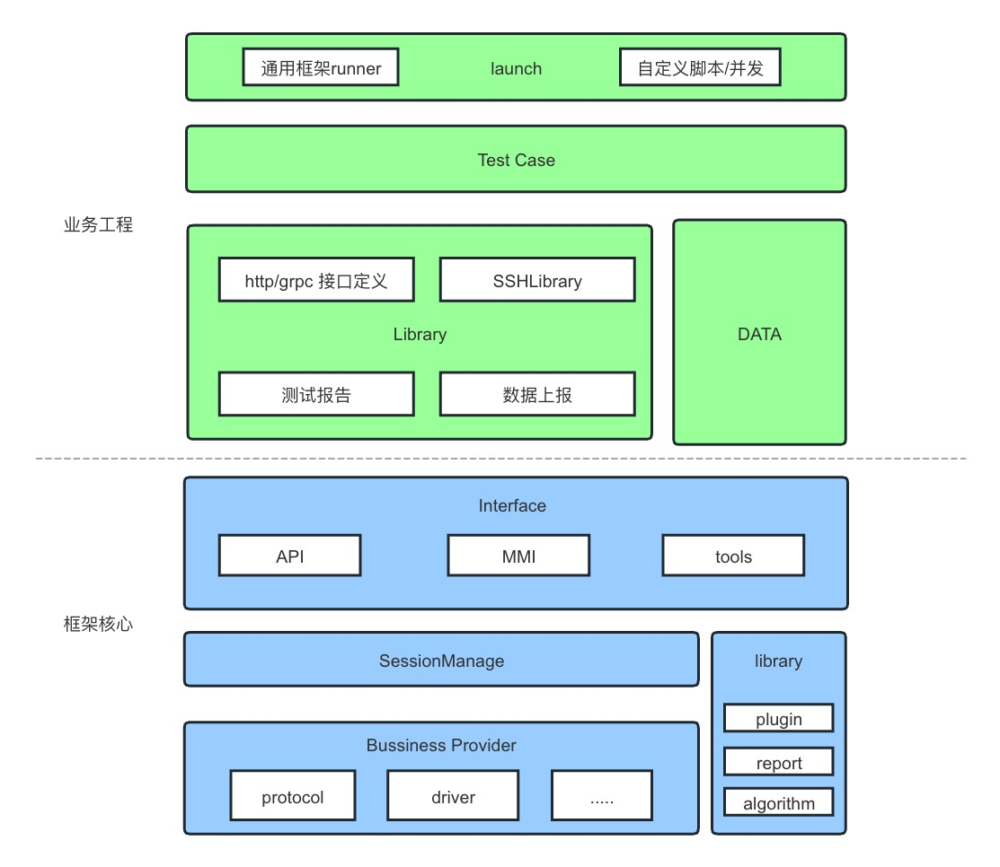
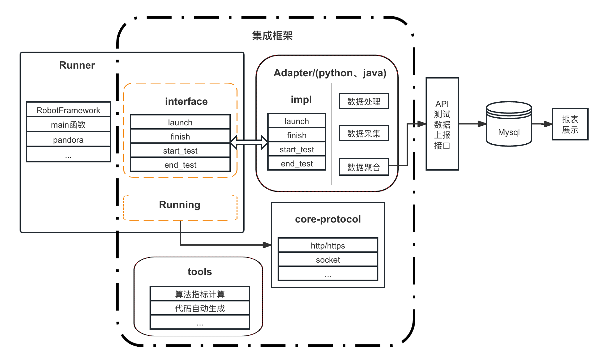

# IntelliPandora

## 一、概要

> IntelliPandora 是Python开发以提供通用能力测试框架
>
> 框架将提供API、UI、算法等业务自动化测试的能力
>
> 同时提供数据上报、开元测试框架(工具)适配、工程(代码)自动生成等基础功能
> 
> 可适配Pytest、RobotFramework等执行框架
>
> 长远规划提供测试智能化的能力

## 二、使用

### 安装下载

- 下载、安装
```shell script
pip install intellipandora
```

### 脚手架能力
- 基础能力使用(命令行)
```shell script
ipandora -h
```

### 使用手册(待添加)
> 包含了框架使用，例如http如何调用，用于接口自动化测试
* [IntelliPandora使用手册](docs/usr/user_guider.md)


## 三、设计与开发

### 3.1 设计说明

#### 3.1.1 目标
* 实现测试系统的自动化；
* 提升自动化的效率、稳定性、通用性；
* 自动化使用的便捷性和可维护性

#### 3.1.2 设计思路
* 分层架构：
  •	测试用例层：编写和管理具体的测试用例。
  •	业务逻辑层：封装业务操作和验证逻辑。
  •	驱动层：与被测系统进行直接交互，如 API 调用、UI 操作等。
  •	数据层：管理测试数据，包括数据准备、数据清理等。
* 模块化设计： 
  * 引擎模块：包括用例生成、测试执行引擎、报告分析、智能化应用等核心功能。
  * 协议模块：处理不同类型的协议，如 HTTP、WebSocket、SSH等。
  * 公共模块：包含常用的工具类库，如日志、配置管理、数据库操作等。 
  * 工具模块：提供命令行工具、调试工具、错误处理等。
* 扩展性与可维护性：
  * 插件机制：允许用户扩展框架功能，如自定义报告格式、新的协议支持等。 
  * 数据和环境管理：支持数据驱动、环境配置等功能，提高测试用例的复用性。
  * 集成化工作流：将测试框架集成到CI/CD管道中，实现自动化的持续测试和部署。

### 3.2 设计实现
* [IntelliPandora开发说明](docs/dev/IntelliPandora_Dev.md)

#### 3.2.1 框架结构介绍
> 代码都在***src/intellipandora***
* **core**: 提供自动化核心能力接口。
  * **base**: 基础类(基类)，如SingletonClass、BaseRepository等
  * **protocol**: 提供协议能力，支持与被测对象交互/通信。如http、grpc、websocket等
  * **engine**: 提供执行引擎，提供框架核心功能，如自动生成、加密、分布式执行处理等
* **common**: 基础方法封装，支持自动化测试断言、数据准备、数据处理等
* **run**: 框架的命令行模块
* **utils**: 框架基础功能，如log、error...
* **conf**: 配置文件

#### 3.2.2 框架设计

* **架构图**
  

* **业务流程图**



## GitHub Feature

1. You can use Readme\_XXX.md to support different languages, such as Readme\_en.md, Readme\_zh.md
2. Explore open source project [IntelliPandora](https://github.com/Conan-Shao/IntelliPandora)